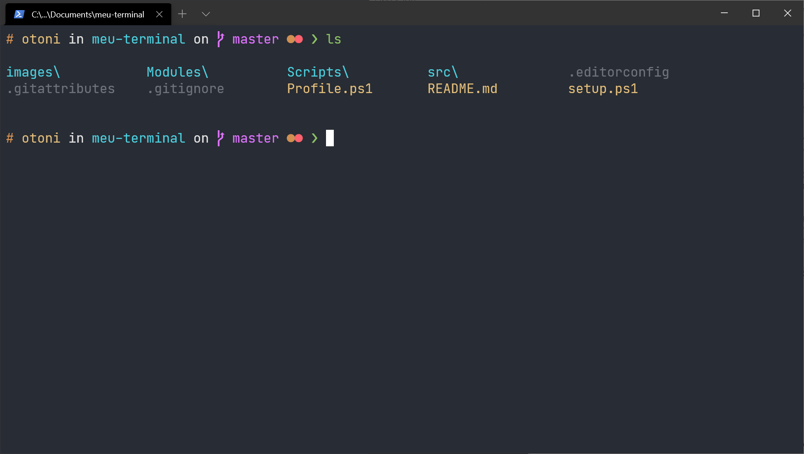
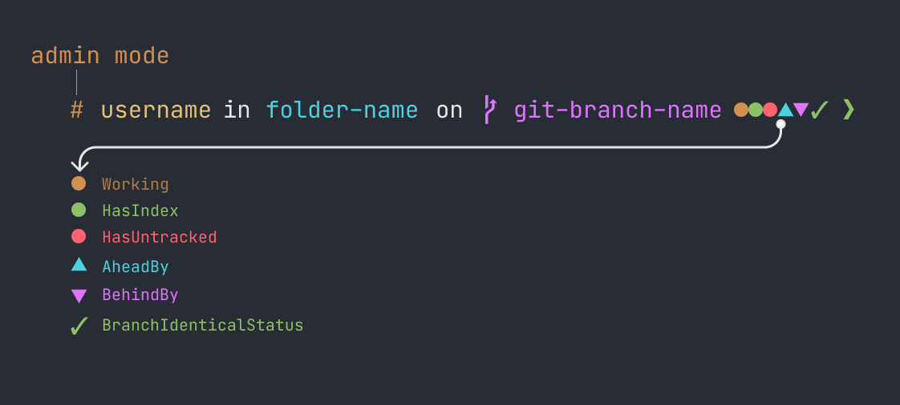

# Meu terminal

Essas são as configurações que uso no meu powershell.



## Pre-requisitos

### Terminal

Você precisa útilizar um terminal moderno como o [Hyper](https://hyper.is/) ou [Windows Terminal](https://github.com/microsoft/terminal), eu recomendo o [Windows Terminal](https://github.com/microsoft/terminal) (imagem acima).

### Package Manager

Antes de atualizar o PowerShellGet, você sempre deve instalar o provedor do NuGet mais recente. Em uma sessão do PowerShell com privilégios elevados, execute os comandos a seguir.

```ps1
Install-PackageProvider -Name NuGet -Force
Exit
```

Para instalar o PowerShellGet no Windows 10, no Windows Server 2016, em qualquer sistema com o WMF 5.0 ou 5.1 instalado ou em qualquer sistema com o PowerShell 6, execute os comandos a seguir em uma sessão do PowerShell com privilégios elevados.

```ps1
Install-Module -Name PowerShellGet -Force
Exit
```

Ou use o `Update-Module` para obter versões mais recentes.

```ps1
Update-Module -Name PowerShellGet
Exit
```

### Liberando a execução de scripts

Eu precisei liberar a execução para ele poder carregar os arquivos de configurações q alguns comando que usaremos a seguir.

```ps1
# Liberar para o usuário atual
Set-ExecutionPolicy -ExecutionPolicy RemoteSigned -Scope CurrentUser

# Ou liberar para todos os usuários
Set-ExecutionPolicy -ExecutionPolicy RemoteSigned
```

### Fontes

Pode ser que o seu terminal não reconheça algum carácter que iremos utilizar na hora de exibir o prompt, por isso recomendo que instale ao menos a `Fira Code` no seu computador.

Fira Code: https://github.com/tonsky/FiraCode<br>
JetBrains Mono: https://www.jetbrains.com/lp/mono/ (opcional)

## Instalação Automática `Beta`

O arquivo `setup.ps1` instala os módulos necessários, copia as pastas de scripts e os arquivos de configurações.

```ps1
# Execute o arquivo de setup no powershell com a linha abaixo
.\setup.ps1
```

## Instalação Manual

### Instalando módulos necessários

```ps1
Install-Module posh-git -Scope CurrentUser
Install-Module -Name PSReadLine -Scope CurrentUser -Force
```

### Criando arquivo $profile

Para habilitar o engine, crie o seu arquivo de perfil do PowerShell

```ps1
# Cria o arquivo
if (!(Test-Path -Path $PROFILE )) { New-Item -Type File -Path $PROFILE -Force }
```

### Copiando arquivos necessários

Copie a pasta `src` para a pasta do arquivo de profile do PowerShell.

```ps
# Você pode encontrar a caminho da pasta e o nome do aquivo executando o comando abaixo no powershell
$profile
```

A estrutura da pasta deve ficar assim:

```
WindowsPowerShell
├── Modules
├── src
└── Microsoft.PowerShell_profile.ps1 (arquivo $profile pode ter outro nome)
```

Agora abra o arquivo `Profile.ps1` e copie o seu conteúdo para o arquivo de profile do PowerShell `$profile`.

```ps1
# Importando módulos
Import-Module -Name posh-git
Import-Module -Name PSReadLine

Import-Module $PSScriptRoot\src\main.psm1
Import-Module $PSScriptRoot\src\libs\powerls.psm1
Import-Module $PSScriptRoot\src\libs\PowerTouch.psm1

Set-Theme otonii

# Importando configurações do PSReadLine
Import-Module $PSScriptRoot\src\configs\PsReadLineConf.psm1

# Sobrescrevendo a função ls
New-Alias -Name ls -Value PowerLS -Option AllScope -Force

# Custom Touch
New-Alias -Name touch -Value PowerTouch -Option AllScope -Force
```

## Prontinho!

Agora o seu PowerShell já está configurado!

## Extras

Algumas configurações extras para deixar o terminal ainda mais bacana. (:

### Removendo a mensagem de incio do powershell (Logo)


Para remover essa mensagem (logo) do powershell toda vez que ele for iniciado
basta adicionar a flag `-nologo` na invocação do programa ou adicionar ao
arquivo de profile a propriedade `Clear-Host` logo no começo do arquivo.

#### Estratégia 1 flag `-nologo` (recomendada)
##### Windows Terminal
Você precisa procurar nesse array o perfil do powershell e adicionar a flag -nologo no final, o meu ficou assim:
```jsonc
{
  // ...
  "profiles": {
    // ...
    "list": [
      {
        // Make changes here to the powershell.exe profile.
        "guid": "{61c54bbd-c2c6-5271-96e7-009a87ff44bf}",
        "name": "Windows PowerShell",
        "commandline": "powershell.exe -nologo", // <- essa linha
        "hidden": false
      }
    ]
    // ...
  }
}
```

##### VSCode
No VSCode você deve adicionar a flag na propriedade `terminal.integrated.shellArgs.windows` veja no exemplo:

```jsonc
{
  //...
  // Removendo mensagem de inicio do powershell
  "terminal.integrated.shellArgs.windows": [
      "-nologo"
  ]
  //...
}
```

#### Estratégia 2 arquivo `$Profile`

Adicione o comando `Clear-Host` no começo do arquivo, eu acho que essa estratégia faz o terminal demorar um pouco mais para abrir.

```ps1
# Limpando Console
Clear-Host

# Importando módulos
...
```


### Configurar o VSCode
O PowerShell no windows já é o terminal padrão do VSCode, mas caso o seu não seja, abra o arquivo de configurações do VSCode e configure a propriedade `terminal.integrated.shell.windows`:

```jsonc
{
  //...
  // Configurando powershell como terminal padrão
  "terminal.integrated.shell.windows": "powershell.exe",
  // Removendo mensagem de inicio do powershell
  "terminal.integrated.shellArgs.windows": [
      "-nologo"
  ]
  //...
}
```

### Configurar o Windows Terminal

Essas são as minhas configurações do windows terminal, nela eu faço apenas algumas configurações de aparência e removo a mensagem de inicio (logo) do powershell. Adicionei também duas opções de temas, `Dracula` e `OneDarkPro` você pode alterar o tema pela propriedade `colorScheme` do arquivo de configurações. `Não copie e cole esse trecho no seu arquivo de configurações, pode ser que a sua versão (no futuro) seja diferente da minha e isso gere erros. Configure as propriedades na mão, assim você vai aprendendo um pouco mais sobre elas`.

```jsonc
// Arquivo de configuração do windows-terminal (https://github.com/microsoft/terminal)
{
  // ...
  "profiles": {
    "defaults": {
      // Habilite essas duas linhas para deixar a sua janela transparente
      // "useAcrylic": true,
      // "acrylicOpacity": 0.7,
      "cursorShape": "filledBox",
      "colorScheme": "OneDarkPro",
      "fontFace": "JetBrains Mono",
      "startingDirectory": ".",
      "fontSize": 14,
      "padding": "8, 8, 8, 8"
    },
    "list": [
      {
        // Make changes here to the powershell.exe profile.
        "guid": "{61c54bbd-c2c6-5271-96e7-009a87ff44bf}",
        "name": "Windows PowerShell",
        "commandline": "powershell.exe -nologo", // flag -nologo aqui
        "hidden": false
      }
      // ...
    ]
  },
  // ...
  "schemes": [
    {
      "name": "Dracula",
      "background": "#272935",
      "black": "#21222C",
      "blue": "#BD93F9",
      "cyan": "#8BE9FD",
      "foreground": "#F8F8F2",
      "green": "#50FA7B",
      "purple": "#FF79C6",
      "red": "#FF5555",
      "white": "#F8F8F2",
      "yellow": "#FFB86C",
      "brightBlack": "#6272A4",
      "brightBlue": "#D6ACFF",
      "brightCyan": "#A4FFFF",
      "brightGreen": "#69FF94",
      "brightPurple": "#FF92DF",
      "brightRed": "#FF6E6E",
      "brightWhite": "#F8F8F2",
      "brightYellow": "#FFFFA5"
    },
    {
      "name": "OneDarkPro",
      "background": "#282C34",
      "black": "#6F747D",
      "blue": "#4AA5F0",
      "cyan": "#42B3C2",
      "foreground": "#E6E6E6",
      "green": "#8CC265",
      "purple": "#C162DE",
      "red": "#E05561",
      "white": "#D7DAE0",
      "yellow": "#D18F52",
      "brightBlack": "#6F747D",
      "brightBlue": "#4DC4FF",
      "brightCyan": "#4CD1E0",
      "brightGreen": "#8CC265",
      "brightPurple": "#DE73FF",
      "brightRed": "#FF616E",
      "brightWhite": "#E6E6E6",
      "brightYellow": "#E5C07B"
    }
  ]
  // ...
}
```

### O que são esses ícones?


